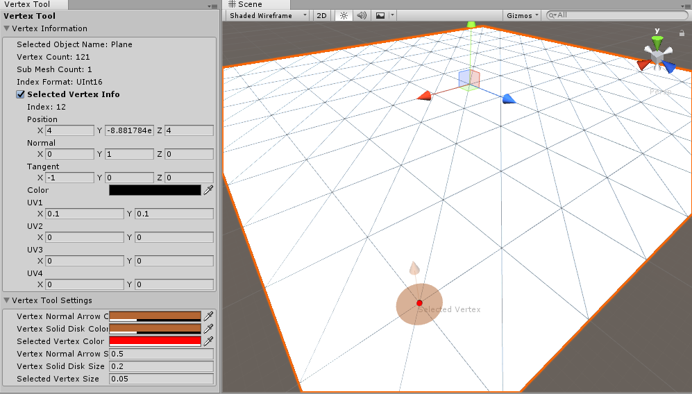

# UnityVertexTool
A handy tool for Unity3D which gives you information about the vertex data on a mesh. Vertex Tool is a tool in Unity game engine which enables developers to debug the vertex data more easily and makes them have access to all this information through a simple UI. 

## Getting Started

After installing the tool you can have access to it through the Unity Window menu. If you open the Vertex Tool window you can easily select any vertex on the mesh object that has a collider. the selected vertex would be highlighted and normal of vertex displays. the window has a section which gives you information like index, position, normals, tangents, colors and ... about the selected vertex. the other section is the settings for the vertex tools which includes normal arrow and selected vertex colour and size.

### Prerequisites

you should have Unity3D installed in order to use Vertex Tool. This tool has tested with Unity 2017 and 2018. 

### Installing

After checking out the source, just put the VertexTool directory in a editor folder in the asset. after reimporting the scripts you can see the new windows menu has added named Vertex Tool.

## Contributing

Please read [CONTRIBUTING.md](https://gist.github.com/PurpleBooth/b24679402957c63ec426) for details on our code of conduct, and the process for submitting pull requests to us.

## Versioning

We use [SemVer](http://semver.org/) for versioning. For the versions available, see the [tags on this repository](https://github.com/your/project/tags). 

## Authors

* **Emad Khezri** - *Initial work* - [Personal Page](https://emadkhezri.github.io)

See also the list of [contributors](https://github.com/your/project/contributors) who participated in this project.

## License

This project is licensed under the MIT License - see the [LICENSE.md](LICENSE.md) file for details

## Acknowledgments

* Hat tip to anyone whose code was used
* Inspiration
* etc
